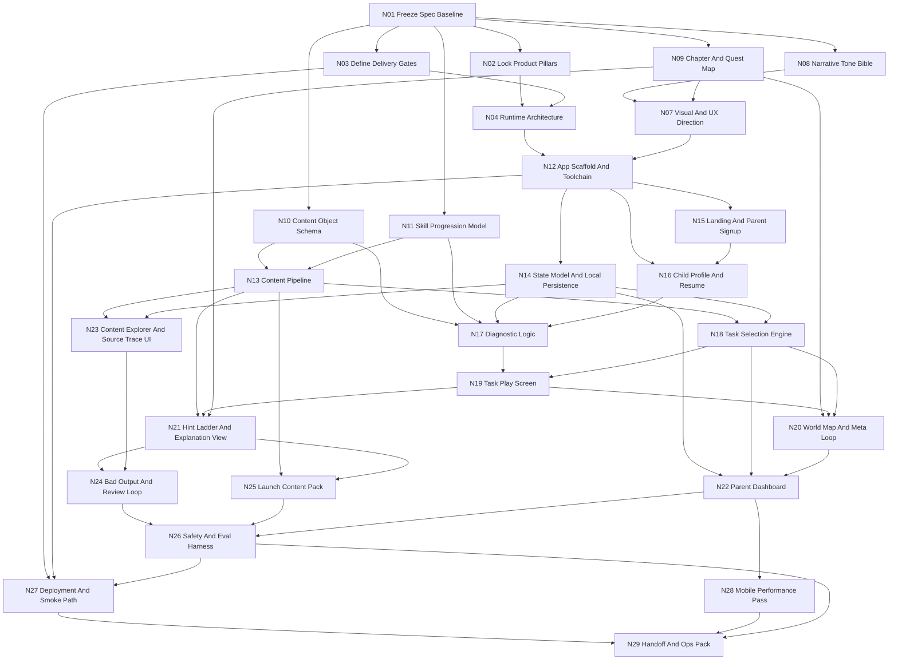

# Sky Of Many Lanterns Execution Graph

## Team
- `P1` Product / Creative Director: scope guard, tone guard, parent value, final calls.
- `P2` Game / UX Designer: child loop, world map, onboarding, feel.
- `P3` Senior Full-Stack Engineer: app architecture, runtime systems, build, deploy.
- `P4` Content / Learning Systems Designer: task bank, skill model, explanation quality, traceability.
- `P5` QA / Release Engineer: validation, safety checks, smoke tests, handoff evidence.

## Working Rule
- We build this like a small serious game studio, not a powerpoint factory.
- Every node must hand something usable to the next node.
- If a downstream node proves an upstream assumption wrong, we go back and fix the graph source, not just patch over it.

## Graph

## Node Table
| Node | Owner | Depends On | Ships | Handoff requirement |
|------|-------|------------|-------|---------------------|
| `N01` Freeze Spec Baseline | `P1` | - | Source-of-truth reading order, assumptions, conflicts list | `in/` docs mapped; unresolved client inputs called out explicitly |
| `N02` Lock Product Pillars | `P1` | `N01` | one-page product truth: buyer, player, loop, non-goals | no feature work starts without this written down |
| `N03` Define Delivery Gates | `P1`, `P5` | `N01` | practical acceptance list for build, UX, safety, release | every later node has a test or inspection path |
| `N04` Runtime Architecture | `P3` | `N02`, `N03` | app boundary, persistence, content/runtime split, deploy shape | chosen stack must support static web shipping and later backend swap |
| `N07` Visual And UX Direction | `P2` | `N08`, `N09` | design system, mobile layout rules, motion rules, parent/child tone split | enough specificity to build screens without inventing style mid-flight |
| `N08` Narrative Tone Bible | `P1`, `P2` | `N01` | Tala/Orin/Mira voice, forbidden phrasing, reward language | child copy cannot drift into chatbot, school, or manipulative tone |
| `N09` Chapter And Quest Map | `P2` | `N01` | 4-region / 12-chapter macro loop, quest types, return hooks | every session screen can point at concrete world state |
| `N10` Content Object Schema | `P4`, `P3` | `N01` | task, hint, explanation, review-state, and source-trace schema | runtime and authoring use the same object shape |
| `N11` Skill Progression Model | `P4` | `N01` | skill strands, difficulty ladder, remediation rules, variety guardrails | selector can use it directly without hidden spreadsheet logic |
| `N12` App Scaffold And Toolchain | `P3` | `N04`, `N07` | runnable app shell, build scripts, lint/test setup | `npm run dev/build/validate` work |
| `N13` Content Pipeline | `P3`, `P4` | `N10`, `N11` | generated runtime task bank and validation scripts | content loads from reviewed structured data, not handwired JSX |
| `N14` State Model And Local Persistence | `P3` | `N12` | household state, learner state, session history, analytics log | state survives reload and is inspectable |
| `N15` Landing And Parent Signup | `P2`, `P3` | `N12` | parent-facing entry, promise, privacy framing, signup | parent can understand value and start quickly |
| `N16` Child Profile And Resume | `P2`, `P3` | `N12`, `N15` | child setup, resume path, first-session handoff | interrupted households can return without dead ends |
| `N17` Diagnostic Logic | `P3`, `P4` | `N10`, `N11`, `N14`, `N16` | 8-12 task baseline diagnostic with progress and scoring | diagnostic sets starting learner state and feels low-pressure |
| `N18` Task Selection Engine | `P3`, `P4` | `N13`, `N14` | adaptive daily-task chooser with recency and difficulty rules | no repeat grind, no hard-streak trap |
| `N19` Task Play Screen | `P2`, `P3` | `N17`, `N18` | task UI, answer flow, retry flow, session pacing | playable on mobile with clear progress and fast feedback |
| `N20` World Map And Meta Loop | `P2`, `P3` | `N09`, `N18`, `N19` | map, camp, chapter progress, companions, return hooks | session completion changes the world in visible ways |
| `N21` Hint Ladder And Explanation View | `P3`, `P4` | `N09`, `N13`, `N19` | two-step hint ladder, final explanation, trace display | support is incremental, grounded, brief, and warm |
| `N22` Parent Dashboard | `P2`, `P3`, `P4` | `N14`, `N18`, `N20` | strongest skill, struggle area, next focus, concrete examples | parent value reads as specific to this child |
| `N23` Content Explorer And Source Trace UI | `P3`, `P4` | `N13`, `N14` | internal content browser and source trace inspector | QA can inspect what is shipping and where it came from |
| `N24` Bad Output And Review Loop | `P4`, `P5` | `N21`, `N23` | flag flow, takedown path, incident record shape | bad hint/task can be disabled and traced quickly |
| `N25` Launch Content Pack | `P4` | `N13`, `N21` | at least 100 reviewed launch tasks with hints and explanations | all launch content is approved and trace-linked |
| `N26` Safety And Eval Harness | `P4`, `P5` | `N22`, `N24`, `N25` | content checks, tone checks, regression tests, eval evidence | launch blockers are visible before release |
| `N27` Deployment And Smoke Path | `P3`, `P5` | `N03`, `N12`, `N26` | prod build path, smoke script, deployment workflow | staging/prod can be reproduced without tribal knowledge |
| `N28` Mobile Performance Pass | `P2`, `P3`, `P5` | `N22` | small-screen polish, loading/perceived-speed pass | child-first and parent-first screens are usable on phones |
| `N29` Handoff And Ops Pack | `P1`, `P3`, `P5` | `N26`, `N27`, `N28` | deployment notes, env list, rollback, acceptance evidence, continuation notes | replacement team can ship and operate the product without guessing |

## Execution Order
### Slice A: Foundations
- `N01` `N02` `N03` `N04` `N07` `N08` `N09` `N10` `N11` `N12`

### Slice B: Playable Core
- `N13` `N14` `N15` `N16` `N17` `N18` `N19` `N20` `N21`

### Slice C: Parent, QA, And Safe Content
- `N22` `N23` `N24` `N25` `N26`

### Slice D: Shipping And Handoff
- `N27` `N28` `N29`

## Handoff Requirements
- Build commands: `npm run dev`, `npm run build`, `npm run validate`
- Product proof: parent onboarding, diagnostic, daily session, hint ladder, parent dashboard
- Content proof: reviewed launch pack, traceable source IDs, reject path for bad outputs
- Ops proof: staging path, production path, smoke checklist, rollback note, ownership note
- Replacement-team proof: architecture note, content schema, state model, release playbook
